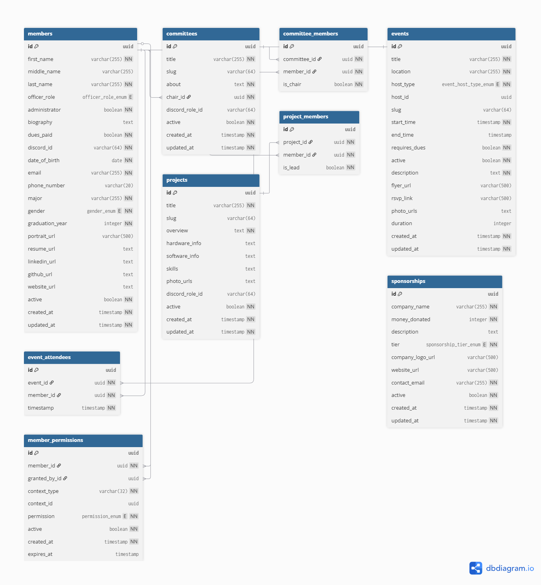

# Database Schema Reference
#### Updated Novemeber 4th 2025, by Dawn Balaschak

This document provides a detailed reference for the database schema, including tables, columns, data types, and constraints. It is generated from `src/lib/schema.ts`.

## Enums

### `officer_role_enum`
*   `executive_chair`, `executive_vice_chair`, `executive_secretary`, `executive_treasurer`, `committee_lead`

### `permission_enum`
*   `scan_attendance`, `view_statistics`, `manage_context`

### `gender_enum`
*   `M`, `F`, `NB`, `O`, `PNTS`

### `sponsorship_tier_enum`
*   `bronze`, `silver`, `gold`

### `event_host_type_enum`
*   `club`, `committee`, `project`, `member`

---

## Tables

### `members`

_Description: Stores information about individual members of the organization._

| Column Name     | Data Type           | Constraints                               |
| :-------------- | :------------------ | :---------------------------------------- |
| `id`            | `uuid`              | Primary Key                               |
| `first_name`    | `varchar(255)`      | Not Null                                  |
| `middle_name`   | `varchar(255)`      |                                           |
| `last_name`     | `varchar(255)`      | Not Null                                  |
| `officer_role`  | `officer_role_enum` |                                           |
| `administrator` | `boolean`           | Not Null, Default: `false`                |
| `biography`     | `text`              |                                           |
| `dues_paid`     | `boolean`           | Not Null, Default: `false`                |
| `discord_id`    | `varchar(64)`       | Not Null, Unique                          |
| `date_of_birth` | `date`              | Not Null                                  |
| `email`         | `varchar(255)`      | Not Null, Unique                          |
| `phone_number`  | `varchar(20)`       |                                           |
| `major`         | `varchar(255)`      | Not Null                                  |
| `gender`        | `gender_enum`       | Not Null                                  |
| `graduation_year`| `integer`           | Not Null                                  |
| `portrait_url`  | `varchar(500)`      |                                           |
| `resume_url`    | `text`              |                                           |
| `linkedin_url`  | `text`              |                                           |
| `github_url`    | `text`              |                                           |
| `website_url`   | `text`              |                                           |
| `active`        | `boolean`           | Not Null, Default: `true`                 |
| `created_at`    | `timestamp`         | Not Null, Default: `now()`                |
| `updated_at`    | `timestamp`         | Not Null, Default: `now()` (on update)    |

**Indexes:**
*   `members_idx_id`: on column (`id`)
*   `members_idx_discord_id`: on column (`discord_id`)
*   `members_idx_email`: on column (`email`)
*   `members_idx_officer_role`: on column (`officer_role`)
*   `members_idx_administrator`: on column (`administrator`)
*   `members_idx_dues_paid`: on column (`dues_paid`)
*   `members_idx_graduation_year`: on column (`graduation_year`)
*   `members_idx_major`: on column (`major`)
*   `members_idx_gender`: on column (`gender`)
*   `members_idx_created_at`: on column (`created_at`)
*   `members_idx_updated_at`: on column (`updated_at`)
*   `members_idx_full_name`: on columns (`first_name`, `last_name`)

### `committees`

_Description: Stores information about the various committees within the organization._

| Column Name     | Data Type           | Constraints                               |
| :-------------- | :------------------ | :---------------------------------------- |
| `id`            | `uuid`              | Primary Key                               |
| `title`         | `varchar(255)`      | Not Null                                  |
| `slug`          | `varchar(64)`       | Unique                                    |
| `about`         | `text`              | Not Null                                  |
| `chair_id`      | `uuid`              | Not Null, References: `members.id`        |
| `discord_role_id`| `varchar(64)`       |                                           |
| `active`        | `boolean`           | Not Null, Default: `true`                 |
| `created_at`    | `timestamp`         | Not Null, Default: `now()`                |
| `updated_at`    | `timestamp`         | Not Null, Default: `now()` (on update)    |

**Indexes:**
*   `committees_idx_id`: on column (`id`)
*   `committees_idx_title`: on column (`title`)
*   `committees_idx_slug`: on column (`slug`)
*   `committees_idx_chair_id`: on column (`chair_id`)
*   `committees_idx_created_at`: on column (`created_at`)
*   `committees_idx_updated_at`: on column (`updated_at`)

### `committee_members`

_Description: Join table linking members to committees they belong to._

| Column Name     | Data Type           | Constraints                               |
| :-------------- | :------------------ | :---------------------------------------- |
| `id`            | `uuid`              | Primary Key                               |
| `committee_id`  | `uuid`              | Not Null, References: `committees.id`     |
| `member_id`     | `uuid`              | Not Null, References: `members.id`        |
| `is_chair`      | `boolean`           | Not Null, Default: `false`                |

**Indexes:**
*   `committee_members_idx_id`: on column (`id`)
*   `committee_members_idx_committee_id`: on column (`committee_id`)
*   `committee_members_idx_member_id`: on column (`member_id`)
*   `committee_members_idx_is_chair`: on column (`is_chair`)

### `events`

_Description: Stores information about events hosted by the organization._

| Column Name     | Data Type           | Constraints                               |
| :-------------- | :------------------ | :---------------------------------------- |
| `id`            | `uuid`              | Primary Key                               |
| `title`         | `varchar(255)`      | Not Null                                  |
| `location`      | `varchar(255)`      | Not Null                                  |
| `host_type`     | `event_host_type_enum`| Not Null                                  |
| `host_id`       | `uuid`              | (Polymorphic Reference)                   |
| `slug`          | `varchar(64)`       | Unique                                    |
| `start_time`    | `timestamp`         | Not Null                                  |
| `end_time`      | `timestamp`         |                                           |
| `requires_dues` | `boolean`           | Not Null, Default: `false`                |
| `active`        | `boolean`           | Not Null, Default: `true`                 |
| `description`   | `text`              | Not Null                                  |
| `flyer_url`     | `varchar(500)`      |                                           |
| `rsvp_link`     | `varchar(500)`      |                                           |
| `photo_urls`    | `text`              |                                           |
| `duration`      | `integer`           |                                           |
| `created_at`    | `timestamp`         | Not Null, Default: `now()`                |
| `updated_at`    | `timestamp`         | Not Null, Default: `now()` (on update)    |

**Indexes:**
*   `events_idx_id`: on column (`id`)
*   `events_idx_host`: on columns (`host_type`, `host_id`)
*   `events_idx_start_time`: on column (`start_time`)
*   `events_idx_title`: on column (`title`)
*   `events_idx_location`: on column (`location`)
*   `events_idx_created_at`: on column (`created_at`)
*   `events_idx_updated_at`: on column (`updated_at`)

### `event_attendees`

_Description: Join table linking members to events they have attended._

| Column Name     | Data Type           | Constraints                               |
| :-------------- | :------------------ | :---------------------------------------- |
| `id`            | `uuid`              | Primary Key                               |
| `event_id`      | `uuid`              | Not Null, References: `events.id`         |
| `member_id`     | `uuid`              | Not Null, References: `members.id`        |
| `timestamp`     | `timestamp`         | Not Null, Default: `now()`                |

**Indexes:**
*   `event_attendees_idx_id`: on column (`id`)
*   `event_attendees_idx_event_id`: on column (`event_id`)
*   `event_attendees_idx_member_id`: on column (`member_id`)

### `projects`

_Description: Stores information about projects undertaken by the organization._

| Column Name     | Data Type           | Constraints                               |
| :-------------- | :------------------ | :---------------------------------------- |
| `id`            | `uuid`              | Primary Key                               |
| `title`         | `varchar(255)`      | Not Null                                  |
| `slug`          | `varchar(64)`       | Unique                                    |
| `overview`      | `text`              | Not Null                                  |
| `hardware_info` | `text`              |                                           |
| `software_info` | `text`              |                                           |
| `skills`        | `text`              |                                           |
| `photo_urls`    | `text`              |                                           |
| `discord_role_id`| `varchar(64)`       |                                           |
| `active`        | `boolean`           | Not Null, Default: `true`                 |
| `created_at`    | `timestamp`         | Not Null, Default: `now()`                |
| `updated_at`    | `timestamp`         | Not Null, Default: `now()` (on update)    |

**Indexes:**
*   `projects_idx_id`: on column (`id`)
*   `projects_idx_title`: on column (`title`)
*   `projects_idx_slug`: on column (`slug`)
*   `projects_idx_created_at`: on column (`created_at`)
*   `projects_idx_updated_at`: on column (`updated_at`)

### `project_members`

_Description: Join table linking members to projects they are involved in._

| Column Name     | Data Type           | Constraints                               |
| :-------------- | :------------------ | :---------------------------------------- |
| `id`            | `uuid`              | Primary Key                               |
| `project_id`    | `uuid`              | Not Null, References: `projects.id`       |
| `member_id`     | `uuid`              | Not Null, References: `members.id`        |
| `is_lead`       | `boolean`           | Not Null, Default: `false`                |

**Indexes:**
*   `project_members_idx_id`: on column (`id`)
*   `project_members_idx_project_id`: on column (`project_id`)
*   `project_members_idx_member_id`: on column (`member_id`)
*   `project_members_idx_is_lead`: on column (`is_lead`)

### `sponsorships`

_Description: Stores information about company sponsorships._

| Column Name     | Data Type           | Constraints                               |
| :-------------- | :------------------ | :---------------------------------------- |
| `id`            | `uuid`              | Primary Key                               |
| `company_name`  | `varchar(255)`      | Not Null                                  |
| `money_donated` | `integer`           | Not Null                                  |
| `description`   | `text`              |                                           |
| `tier`          | `sponsorship_tier_enum`| Not Null                                  |
| `company_logo_url`| `varchar(500)`      |                                           |
| `website_url`   | `varchar(500)`      |                                           |
| `contact_email` | `varchar(255)`      | Not Null                                  |
| `active`        | `boolean`           | Not Null, Default: `true`                 |
| `created_at`    | `timestamp`         | Not Null, Default: `now()`                |
| `updated_at`    | `timestamp`         | Not Null, Default: `now()` (on update)    |

**Indexes:**
*   `sponsorships_idx_id`: on column (`id`)
*   `sponsorships_idx_company_name`: on column (`company_name`)
*   `sponsorships_idx_tier`: on column (`tier`)
*   `sponsorships_idx_created_at`: on column (`created_at`)
*   `sponsorships_idx_updated_at`: on column (`updated_at`)

### `member_permissions`

_Description: Defines custom permissions granted to members within specific contexts._

| Column Name     | Data Type           | Constraints                               |
| :-------------- | :------------------ | :---------------------------------------- |
| `id`            | `uuid`              | Primary Key                               |
| `member_id`     | `uuid`              | Not Null, References: `members.id`        |
| `granted_by_id` | `uuid`              | References: `members.id`                  |
| `context_type`  | `varchar(32)`       | Not Null                                  |
| `context_id`    | `uuid`              | (Polymorphic Reference)                   |
| `permission`    | `permission_enum`   | Not Null                                  |
| `active`        | `boolean`           | Not Null, Default: `true`                 |
| `created_at`    | `timestamp`         | Not Null, Default: `now()`                |
| `expires_at`    | `timestamp`         |                                           |

**Indexes:**
*   `member_permissions_idx_member`: on column (`member_id`)
*   `member_permissions_idx_context`: on columns (`context_type`, `context_id`)

---

## Relationships

This section describes the foreign key relationships and unique constraints between tables.

### Foreign Key Relationships

*   A `committees.chair_id` must be an existing `id` in the `members` table.
*   A `committee_members.committee_id` must be an existing `id` in the `committees` table.
*   A `committee_members.member_id` must be an existing `id` in the `members` table.
*   An `event_attendees.event_id` must be an existing `id` in the `events` table.
*   An `event_attendees.member_id` must be an existing `id` in the `members` table.
*   A `project_members.project_id` must be an existing `id` in the `projects` table.
*   A `project_members.member_id` must be an existing `id` in the `members` table.
*   A `member_permissions.member_id` must be an existing `id` in the `members` table.
*   A `member_permissions.granted_by_id` must be an existing `id` in the `members` table.

### Polymorphic Relationships

*   The `events.host_id` column refers to an `id` in another table based on the value of `host_type`. For example, if `host_type` is `'committee'`, `host_id` refers to `committees.id`.
*   The `member_permissions.context_id` column refers to an `id` in another table based on the value of `context_type`.

### Unique Constraints

*   In `committee_members`, the combination of `committee_id` and `member_id` must be unique.
*   In `event_attendees`, the combination of `event_id` and `member_id` must be unique.
*   In `project_members`, the combination of `project_id` and `member_id` must be unique.
*   In `member_permissions`, the combination of `member_id`, `context_type`, `context_id`, and `permission` must be unique.

### Diagram of Relationships
