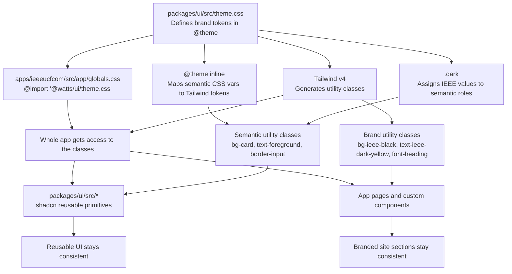

# Styling Architecture

This document explains the styling system in plain English.

If `docs/STYLING.md` is the rulebook for **what styles to use**, this file explains **how the styling system works** and **where to make changes**.

Ported from the IEEE-Website repo's `styling` branch and adapted for the WATTS monorepo —
the token layer now lives in the shared `@watts/ui` package so future website derivatives
inherit it, rather than in the app's own `globals.css`.

---

## 1. The short version

The project has 4 styling layers, split across 2 packages:

1. `packages/ui/src/theme.css` (shared package)
   - the global source of truth
   - defines design tokens like colors and fonts
2. Tailwind v4
   - turns those tokens into utility classes like `bg-ieee-black`
3. `packages/ui/src/*` (shared package)
   - reusable UI primitives, mostly shadcn-based
   - should use **semantic tokens**
4. App components and pages (`apps/ieeeucfcom/src/**`)
   - things like navbar, timer, projects page, about page
   - should use **IEEE brand token classes** directly for brand-specific styling

### Mermaid diagram



---

## 2. What `@theme` does

In Tailwind v4, the `@theme` block inside `packages/ui/src/theme.css` defines tokens.

Example:

```css
@theme {
  --color-ieee-dark-yellow: #ffc72c;
  --font-heading: heading-font, sans-serif;
}
```

Tailwind reads that and automatically generates utility classes.

So these become available everywhere:

```tsx
className="bg-ieee-dark-yellow"
className="text-ieee-dark-yellow"
className="border-ieee-dark-yellow"
className="font-heading"
```

That is what I mean by **token classes**:
- classes generated from tokens defined in `@theme`

Examples of token classes:
- `bg-ieee-black`
- `text-ieee-light-grey`
- `border-ieee-dark-grey`
- `ring-ieee-bright-yellow`
- `font-heading`
- `font-body`

---

## 3. Is `@theme` imported on every page?

Not page-by-page.

It is loaded once through the app's global stylesheet:

- `apps/ieeeucfcom/src/app/globals.css` runs `@import '@watts/ui/theme.css'`
- `apps/ieeeucfcom/src/app/layout.tsx:2` imports `./globals.css`

Because `layout.tsx` wraps the whole app, `globals.css` — and the theme it pulls in from
`@watts/ui` — applies everywhere under the App Router.

That means:
- pages do **not** need to import the theme themselves
- components do **not** need to import the theme themselves
- the classes generated from `@theme` are available throughout the app

So the flow is:

`packages/ui/src/theme.css` -> imported by `apps/ieeeucfcom/src/app/globals.css` -> imported by `layout.tsx` -> available to the whole app

---

## 4. Brand tokens vs semantic tokens

There are 2 important token types in this project.

### Brand tokens

These are the actual IEEE colors and fonts.

Examples from `packages/ui/src/theme.css`:
- `--color-ieee-black`
- `--color-ieee-near-black`
- `--color-ieee-dark-yellow`
- `--font-heading`
- `--font-body`

These create classes like:
- `bg-ieee-near-black`
- `text-ieee-dark-yellow`
- `font-heading`

Use these when the UI is intentionally IEEE-branded.

### Semantic tokens

These describe the **role** of a style, not the raw color.

Examples:
- `--card`
- `--card-foreground`
- `--input`
- `--border`
- `--popover`
- `--muted`
- `--muted-foreground`

These create classes like:
- `bg-card`
- `text-card-foreground`
- `bg-input`
- `border-border`
- `text-muted-foreground`

Use these for reusable UI primitives.

---

## 5. Why both kinds of tokens exist

Because they solve different problems.

### Brand tokens answer:
- What is IEEE yellow?
- What is our dark surface color?
- What font should headings use?

### Semantic tokens answer:
- What color should a card background be?
- What color should an input border be?
- What color should muted helper text be?

This lets us keep:
- one brand palette
- one reusable UI system

without hardcoding colors into every component. It's also what lets `packages/ui` be
brand-neutral: a future website derivative swaps the IEEE brand tokens in its own
`theme.css` and every semantic-token primitive re-themes for free.

---

## 6. How shadcn fits into this

shadcn components are the files in:

- `packages/ui/src/button.tsx`
- `packages/ui/src/card.tsx`
- `packages/ui/src/input.tsx`
- `packages/ui/src/select.tsx`
- etc.

They are just React components with Tailwind classes inside them, published from the
`@watts/ui` package so every app in the monorepo (website, and any future derivative) can
import them.

shadcn does **not** own your theme by itself.

Instead:
- the component defines class names
- your global tokens decide what those class names mean

Example:

If a component uses:

```tsx
className="bg-card text-card-foreground border-border"
```

then the actual colors come from the semantic token mapping in `packages/ui/src/theme.css`.

That is why `theme.css` is the real source of truth.

---

## 7. What `@theme inline` is doing

This block in `packages/ui/src/theme.css`:

```css
@theme inline {
  --color-card: var(--card);
  --color-border: var(--border);
  --color-input: var(--input);
}
```

maps CSS variables into Tailwind token names.

This is what allows classes like:
- `bg-card`
- `border-border`
- `bg-input`

to work.

In other words:

- `--card` is a runtime CSS variable
- `@theme inline` exposes it to Tailwind as `card`
- then Tailwind gives you `bg-card`

---

## 8. What `.dark` is doing

The `.dark` block in `packages/ui/src/theme.css` assigns values to semantic tokens for dark
mode.

Example:

```css
.dark {
  --card: var(--color-ieee-near-black);
  --border: var(--color-ieee-dark-grey);
  --input: var(--color-ieee-dark-grey);
}
```

That means:
- `bg-card` becomes IEEE near-black
- `border-border` becomes IEEE dark-grey
- `bg-input` becomes IEEE dark-grey

Because `apps/ieeeucfcom/src/app/layout.tsx` sets:

```tsx
<html lang="en" className="dark">
```

the app is always using the dark theme mapping right now — there is no light mode and no
toggle. Marketing pages and admin pages share this one `.dark` scope (unlike an earlier,
abandoned attempt at this migration that used a separate `:root`/`.theme-marketing` split —
this codebase does not have that; there is exactly one active token scope).

---

## 9. The standard we should follow

This is the standard going forward.

### `packages/ui/src/*` should prefer semantic tokens

These are reusable primitives, shared by every app in the monorepo.

They should usually use classes like:
- `bg-card`
- `text-card-foreground`
- `border-border`
- `bg-input`
- `text-foreground`
- `text-muted-foreground`
- `bg-popover`

Why:
- they stay reusable across apps/derivatives
- they do not hardcode IEEE styling decisions directly
- changing semantic mapping in `theme.css` updates all of them

### App components and pages should prefer IEEE token classes

These are brand-specific pieces of the site, living in `apps/ieeeucfcom/src/**`.

They should usually use classes like:
- `bg-ieee-black`
- `bg-ieee-near-black`
- `text-ieee-dark-yellow`
- `border-ieee-dark-grey`
- `hover:text-ieee-bright-yellow`
- `font-heading`
- `font-body`

Why:
- navbar, hero sections, event cards, about headers, etc. are intentionally branded
- direct IEEE token usage makes that explicit

---

## 10. How the current project supports `docs/STYLING.md`

The current setup already supports the styling guide pretty well.

### What already matches the guide

1. **Global brand token source exists**
   - `packages/ui/src/theme.css`
   - IEEE colors and font tokens are already defined in `@theme`

2. **Global app import exists**
   - `apps/ieeeucfcom/src/app/globals.css` imports `@watts/ui/theme.css`
   - `apps/ieeeucfcom/src/app/layout.tsx` loads `globals.css` app-wide

3. **Dark theme is globally active**
   - `apps/ieeeucfcom/src/app/layout.tsx` sets `className="dark"` on `<html>`
   - semantic token mapping is active through `.dark`

4. **Many app components already use IEEE token classes**
   - examples: navbar, settings, home page, projects page

5. **Shared UI primitives can now be themed centrally**
   - examples: `button.tsx`, `card.tsx`, `field.tsx`, `input.tsx`, `select.tsx` in
     `packages/ui/src/`

### Where the current setup is still mixed

1. **A few `ui/` components are intentionally brand-specific**
   - example: `apps/ieeeucfcom/src/components/ui/glow-button.tsx`
   - those live in the app, not `packages/ui`, and are closer to branded app components
     than generic primitives

2. **Some app components still have one-off styling**
   - especially older components and test pages
   - these should keep moving toward IEEE token classes

So the system is supporting `docs/STYLING.md`, and the main remaining cleanup is in older
app-level components rather than the shared form/card primitives.

---

## 11. Practical editing rules

If you want to change styling globally, use this order:

### Change 1: update brand palette or fonts

Edit:
- `packages/ui/src/theme.css` inside `@theme`

Use when:
- IEEE yellow changes
- dark grey changes
- a font family changes

This change affects every app that consumes `@watts/ui`, not just the website.

### Change 2: update semantic role mapping

Edit:
- `packages/ui/src/theme.css` inside `.dark`

Use when:
- cards should use a different surface color
- inputs should look different from cards
- muted text should be lighter/darker

### Change 3: update reusable UI primitives

Edit:
- `packages/ui/src/*`

Use when:
- all buttons should change behavior
- all inputs should change spacing or focus style
- all cards should change border or padding

### Change 4: update page/component-specific styling

Edit:
- `apps/ieeeucfcom/src/app/**` page files
- `apps/ieeeucfcom/src/components/**` app-local components

Use when:
- a specific hero section needs a custom layout
- a specific branded section needs a unique gradient

---

## 12. Decision guide: semantic or IEEE?

Use **semantic tokens** when the component is:
- reusable
- generic
- part of the shared `@watts/ui` system
- meant to work in multiple contexts (or apps)

Use **IEEE token classes** when the component is:
- page-specific
- obviously brand-driven
- intentionally using IEEE accent colors
- part of the site identity

### Example

Good semantic:

```tsx
<div className="bg-card text-card-foreground border border-border" />
```

Good IEEE-branded:

```tsx
<section className="bg-ieee-black text-white">
  <h1 className="font-heading text-ieee-bright-yellow">Projects</h1>
</section>
```

---

## 13. Recommended next cleanup pass

To fully standardize the project, the next pass should do this:

1. Review every file in `packages/ui/src/`
2. Decide whether each primitive should be:
   - semantic
   - or intentionally IEEE-branded (and if so, whether it belongs in the app instead)
3. Update `docs/STYLING.md` examples to match that standard where needed
4. Audit app components for:
   - hardcoded one-offs
   - leftover generic grays
   - direct styling that should instead go through tokens

---

## 14. Final mental model

If you only remember one thing, remember this:

- `packages/ui/src/theme.css` defines the styling language, shared across the monorepo
- `apps/ieeeucfcom/src/app/globals.css` pulls that language in for the website
- Tailwind turns that language into utility classes
- shadcn primitives in `packages/ui/src/*` should mostly speak in semantic roles
- app components in `apps/ieeeucfcom/src/**` should mostly speak in IEEE brand tokens

That gives you one system instead of lots of one-off styles — and one that future website
derivatives can inherit by depending on `@watts/ui`.
